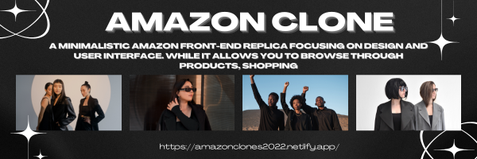

<h1 align="center">
    
</h1>

<h1 align="center">
  <a href="https://amazonclones2022.netlify.app/"> Amazon Clone</a>
</h1>

<h3 align="center"></h3>

<p align="center">
  
  <a href="https://github.com/Mominuddin07/AmazonClone">
    
  </a>
  
  <a href="https://github.com/Mominuddin07/">
    
  </a>
</p>

<h4 align="center"> 
	 Status: Finished
</h4>

<p align="center">
 <a href="#about">About</a> •
 <a href="#features">Features</a> •
 <a href="#how-it-works">How it works</a> • 
 <a href="#tech-stack">Tech Stack</a> •  
 <a href="#author">Author</a> • 
 <a href="#user-content-license">License</a>
</p>

## About

PROJECT - Amazon Clone is a web application built using **HTML**, **CSS**, and **JavaScript**, replicating the design and functionality of Amazon's front-end.

---

## Features

- [x] Search Bar for finding products
- [x] Shopping Cart Functionality
- [x] Mobile responsive design
- [x] Basic interactive features using JavaScript

---

## How it works

1. **Frontend**: Built with **HTML** for structure, **CSS** for styling, and **JavaScript** for interactivity.
2. **No backend**: This project is purely frontend with no server-side functionality.

### Pre-requisites

Before you begin, make sure you have the following tools installed on your machine:
- [Git](https://git-scm.com)
- A code editor like [VSCode](https://code.visualstudio.com/)

#### Running the web application (Frontend)

```bash
# Clone this repository
$ git clone git@github.com:Mominuddin07/AmazonClone.git

# Navigate to the project folder
$ cd AmazonClone

# Install dependencies
$ npm install

# Start the application
$ npm start

# The application will run on http://localhost:3000
```


#### **Frontend**

- **HTML**: For the structure of the pages
- **CSS**: For styling and layout
- **JavaScript**: For adding interactivity and dynamic behavior

#### **Utils**

- **Editor**: [Visual Studio Code](https://code.visualstudio.com/) → A code editor used for writing and debugging the application.
- **Icons**: [Font Awesome](https://fontawesome.com/) → A collection of customizable icons for the project.
- **Fonts**: [Outfit](https://fonts.google.com/specimen/Outfit) → Font used in the app for modern, clean typography with multiple weight options for flexibility.

---

## Author

<a href="https://www.linkedin.com/in/mohammed-mominuddin-350180259/">
 
 <br />
 <p><b>Mohammed Mominuddin</b></p></a>
 
[](https://www.linkedin.com/in/mohammed-mominuddin-350180259/)

---

## License

This project is under the license [MIT](./LICENSE).

Made with love by Mohammed Mominuddin 👋🏽 [Get in Touch!](https://www.linkedin.com/in/mohammed-mominuddin-350180259/)

---

## Learn More

This project was created using **HTML**, **CSS**, and **JavaScript**.

You can learn more about HTML, CSS, and JavaScript through their respective documentation.


